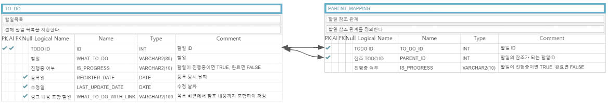
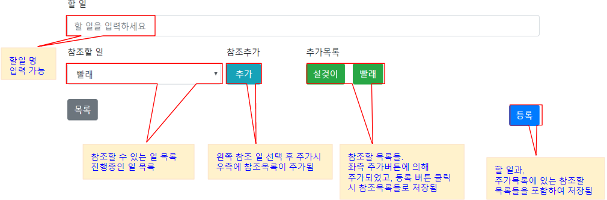

## 개발 목표
1. 할일 목록(todo-list) 웹 어플리케이션 구현
2. 간단한 실행을 위하여 단일 Instance 구동 가능 프로그램

## 개발 TOOL
 - Spring Boot
 - gradle
 - JPA
 - H2
 - Swagger
 - Handlebars
 - Selenium
 - JUnit
 - jQuery
 - Bootstrap

## 개발환경
 - windows 64bit
 - JDK 1.8
 - IntelliJ

## 구동 방법
 - commandline에서 아래 명령어 실행
```console
    gradlew clean build bootRun
```

 - <a href="http://localhost:8080/swagger-ui.html">swagger</a>에서 API 확인

 - <a href="http://localhost:8080/view/1">화면</a>에서 동작 확인

 - <a href="http://localhost:8080/h2-console">H2 Console</a>에서 DB 확인
    1. URL => jdbc:h2:mem:testdb
    2. ID => sa
    3. no password

## 문제 해결 전략
 - ERD는 최대한 간단하게

 

 - JPA 활용 쿼리 최소화
    1. JPA 기본 제공 method 최대한 활용(findBy, save, remove)
    2. JPA Pageable 을 활용하여 Paging 간단하게 구현
    3. Entity 최대한 간단하게 정의
    4. JPA 제공하는 FK 사용하지 않음(Entity 안에 참조 Entity를 포함하게 되어 객체가 너무 커짐)

 - data.sql 이용하여 기초데이터 생성
    1. 테스트에 적합한 기본 데이터 환경 구성

 - 화면은 최대한 빠르고 별도 Instance 없이 구동 가능한 OpenSource 적극 활용
    1. Handlebars
    2. jQuery
    3. Bootstrap

 - Test 원칙
    1. Test 선 작성 개발코드 후 작성 원칙
    2. 변경사항이 큰 경우, 원 소스를 수정한 후 테스트 코드 수정 및 보완
    3. 서비스가 커지는 경우 BDD 기반, 기능이 작은 경우 TDD 기반 작성
    4. 통합테스트는 selenium으로 구현하였으나, windows에서만 동작 가능하므로, Ignore 상태

 - API 설계 원칙
    1. Method를 목적에 맞게 명확하게 구분
        1. GET : 조회
        2. POST : 생성
        3. PUT : 변경
        4. DELETE : 삭제

    2. 응답 코드를 요청 목적에 맞게 반환
        1. 조회성 요청엔 200
        2. 생성 요청엔 201
        3. 변경 요청엔 205

## 화면 설명
 - 목록화면


 - 등록화면



 - 수정화면

